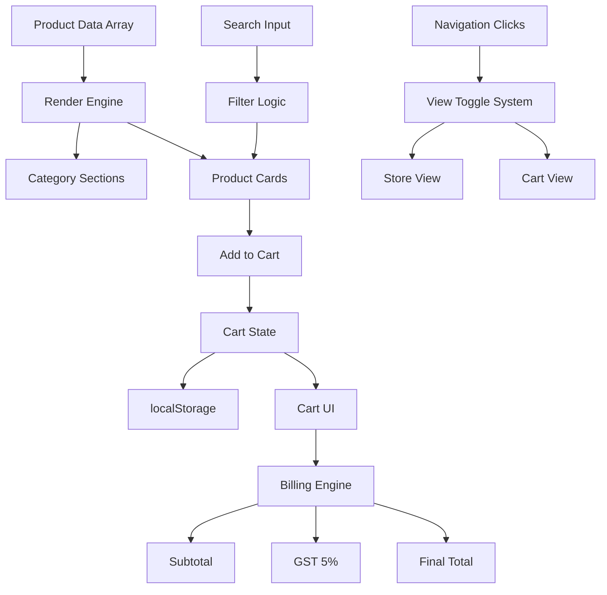

# ⚡ VanillaMart — Quick Commerce Frontend Prototype

VanillaMart is a **mobile-first quick-commerce (q-commerce) web application** built entirely using **Vanilla HTML, CSS, and JavaScript** — no frameworks, no libraries, no dependencies.

It replicates the core experience of apps like Blinkit/Zepto:
- fast browsing
- instant cart updates
- real-time search
- smooth app-like navigation

All logic runs **fully in the browser**, making it a pure frontend engineering project focused on **state management, DOM manipulation, and UI behavior**.

---

## 🚀 Live Demo

👉 https://metakushal.github.io/VanillaMart/

---

## 🧠 Core Concept

VanillaMart is not just a UI clone — it's a **functional SPA-style grocery app simulation**.

Instead of traditional page navigation:
- views are toggled using CSS (`.active` / `.hidden`)
- all data is handled in-memory via JavaScript
- cart state persists using `localStorage`

This makes it behave like a **native mobile app**, while still being a static website.

---

## 🛠️ Tech Stack


---

## ⚙️ Key Features

### 📱 Mobile-First UI
- Designed primarily for mobile devices
- Bottom navigation bar for app-like feel
- Horizontal “swimlane” scrolling for categories
- Responsive layout using Flexbox

---

### 🔄 Single Page Application (SPA)
- No page reloads
- Views switched via class toggling:
  - `store-view`
  - `cart-view`
- Instant transitions → faster UX

---

### 🔍 Real-Time Search Overlay
- iOS-style bottom search panel
- Live filtering on every keystroke
- Results rendered dynamically from product array

---

### 🛒 Cart Engine (Core Logic)
- Add / Remove items
- Increment / Decrement `[ - 1 + ]`
- Auto-remove when quantity = 0
- Dual cart counters (desktop + mobile)

---

### 💰 Billing System
- Subtotal calculation
- GST (5%) applied dynamically
- Final total updates instantly

---

### 💾 Persistent State
- Uses `localStorage`
- Key: `quickMartCart`
- Cart survives page refresh

---

### ⚡ Micro Interactions
- Toast notifications on add-to-cart
- Smooth transitions
- Instant UI feedback

---

### 🖼️ Image Handling
- Images fetched via Unsplash URLs
- Uniform sizing using: object-fit: cover
- Prevents layout break

---

## 🧩 Architecture Overview



## 📂 Project Structure

```
VanillaMart/
│
├── index.html      # App layout (views, navigation, structure)
├── style.css       # UI styling, responsiveness, layout system
├── script.js       # Core logic (state, rendering, cart, search)
└── README.md       # Documentation
```

---

## ⚙️ How It Works (Under the Hood)

### 1. 🧩 Product Rendering
- Products are stored in a JavaScript array  
- Grouped dynamically by category  
- Injected into the DOM using JavaScript  

---

### 2. 🗃️ State Management
Cart is maintained as an array of objects:

```js
{ id, name, price, quantity }
```

- Stored in memory during runtime  
- Persisted using `localStorage`  

---

### 3. 🔄 View System
- No routing  
- No page reloads  

Switching views is handled using:

```js
element.classList.toggle()
```

---

### 4. 🔍 Search Logic
- Filters product array in real-time  
- Matches using:

```js
product.name.toLowerCase().includes(query)
```

- Updates UI instantly as user types  

---

## ▶️ Running Locally

No setup required.
Open directly:
```bash
index.html
```

---

## ⚠️ Limitations

- No backend  
- No authentication  
- No real checkout/payment  
- Static product data  
- No API integration  

This is a **frontend prototype**, not a production-ready ecommerce system.

---

## 🔮 Future Improvements

- Backend integration (Node / Firebase / Supabase)  
- Authentication system  
- Payment gateway integration  
- Dynamic product API  
- Wishlist & order history  
- PWA support  
